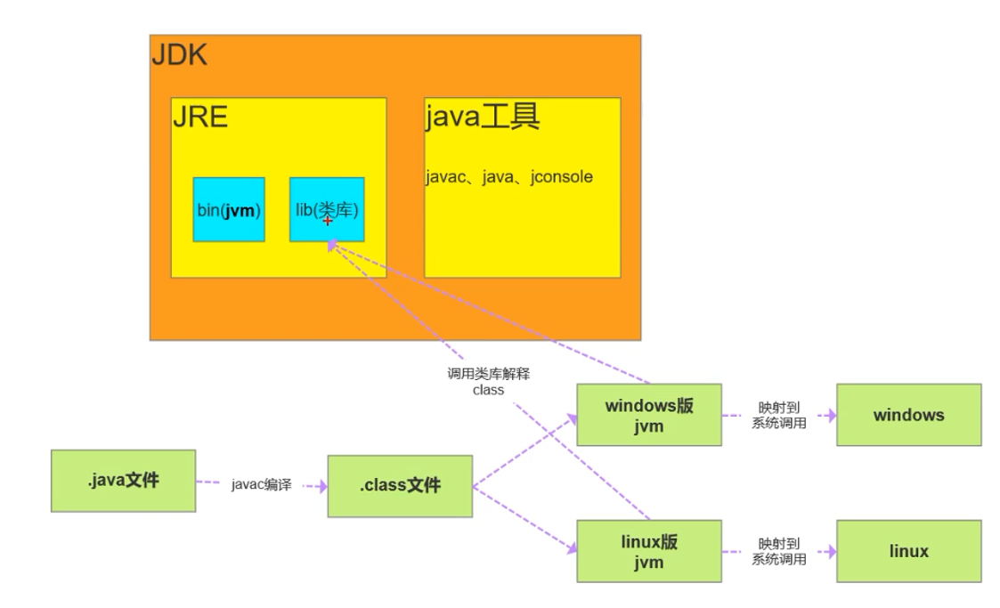

#JDK Java Development Kit
>Java开发工具，包含JRE，提供给Java开发人员用的
>Jre + Javac、Java、Jconsole、Jstack...

#JRE Java Runtime Environment
>Java运行环境，如果只想运行Java只安装Jre即可  (对应/jre目录)
>jre (bin、lib)

#JVM Java Visual Machine
>编译和解释.class文件 --> 机器码     (对应/bin目录)

#范围:JDK > JRE > JVM

>图示：
>

#流程
>.java文件 --javac编译--> .class文件 --调用类库解释class文件翻译成机器码 --> 映射到系统调用